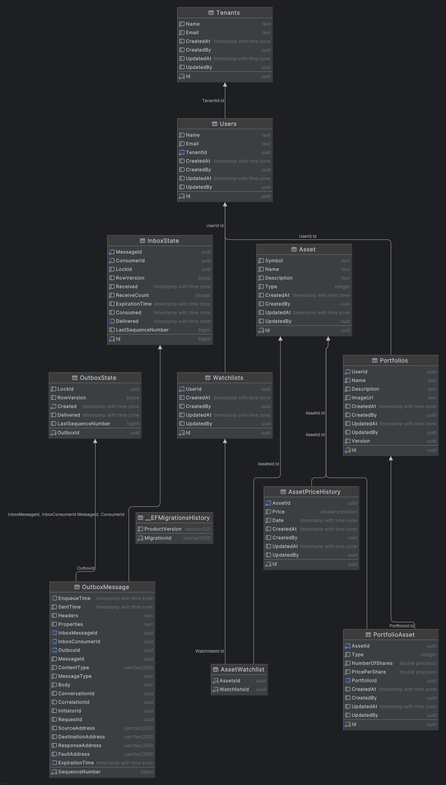

***

# Market Wizard API

This project follows a **clean architecture API** for managing investment portfolios. It allows users to **create, update, and delete portfolios with associated stocks**, while following modern .NET backend development practices.

The API is built with the following technologies:

- **GraphQL (HotChocolate)** – query and mutate data using a schema-first approach
- **MediatR** – for clean separation of concerns and request/response handling
- **Entity Framework Core (EF Core)** – data access with LINQ and repository abstractions
- **PostgreSQL** – relational database backend
- **FluentValidation** – robust request validation
- **Serilog + Seq** – structured logging and centralized log management
- **Clean Architecture principles** – ensuring testability, separation of concerns, and scalability

***

## Features

- Create new investment portfolios
- Update portfolio details (e.g., name, description, stocks)
- Delete portfolios
- Query all portfolios or fetch individual portfolio details
- GraphQL endpoint with typed schema for flexible queries
- Centralized structured logging with Serilog, output to Seq

***

## Project Structure

The project implements **Clean Architecture**, separating concerns across layers:

- **Domain** – Entities, value objects, and business rules
- **Application** – Use cases implemented with MediatR, validators with FluentValidation
- **Infrastructure** – Entity Framework Core, PostgreSQL persistence, external services
- **Api** – GraphQL API using HotChocolate

Typical layer dependencies flow **inward only**, following clean architecture principles.

***

## Tech Stack

- **.NET 9 / ASP.NET Core**
- **HotChocolate GraphQL**
- **MediatR** for CQRS and decoupled request handling
- **Entity Framework Core** with **PostgreSQL** provider
- **FluentValidation** for command validation
- **Docker** support (for PostgreSQL and Seq containerization)
***

## Getting Started

### Prerequisites

- [.NET 9 SDK](https://dotnet.microsoft.com/download)
- [PostgreSQL](https://www.postgresql.org/download/) or [Docker](https://www.docker.com/) for containerized database
- Seq for centralized logging (via local install or Docker)

### Installation \& Setup

1. Clone the repository:

```bash
git clone https://github.com/jonattfin/marketwizard-api
cd portfolio-api
```

3. Apply EF Core migrations:

```bash
```

4. Run the API:

```bash
dotnet run --project WebApi


***

## GraphQL Usage

The GraphQL endpoint is available at:

```
http://localhost:5196/graphql/
```


### Example Queries \& Mutations

#### Create a portfolio

```graphql
mutation {
  createPortfolio(command: { name: "My Portfolio", description: "Tech Stocks" }) {
    id
    name
    description
  }
}
```


#### Fetch portfolios

```graphql
query {
  portfolios {
    id
    name
    stocks {
      ticker
      shares
    }
  }
}
```


***

## Validation

- All commands (create/update/delete) use **FluentValidation** to enforce data integrity.
- Example rules: portfolio name must not be empty, stock ticker must be uppercase, share count must be greater than zero.

***

## Testing

- Unit tests cover application use cases (CQRS handlers, validations).

Run tests with:

```bash
dotnet test
```
## Db diagram



***

## Roadmap

- User authentication and authorization (JWT/Auth0 integration)
- Add stocks to portfolios
- Portfolio performance statistics (including prices, market value)

***


